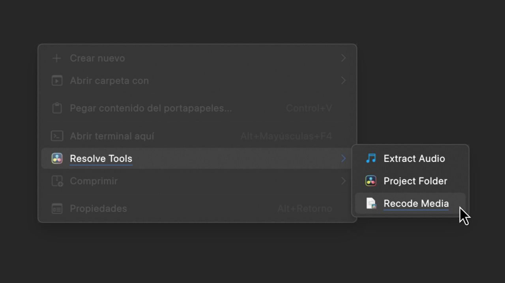

# Resolve Tools

Resolve Tools is a collection of practical tools and utilities designed to simplify and streamline a variety of common processes and tasks. The toolset covers a wide range of functionality, from file and directory manipulation to workflow automation.



With Resolve Tools, users can save time and effort by having at their disposal a set of efficient and reliable solutions that allow them to focus on their core tasks without worrying about technical details. Resolve Tools offers versatile, easy-to-use tools that can be tailored to a wide variety of needs.

Explore the Resolve Tools suite and discover how you can simplify and streamline your daily workflows.

## ✨ Key Features

- **Project Creation:** Generates a complete folder structure (Audio, Footage, Images, etc.) for a new project with a single click.
- **Media Recoding:** Converts video files in a video/audio codec compatible with DaVinci Resolve.
- **Audio Extraction:** Quickly extracts the audio track from any video file and saves it as a high-quality `.flac` file.
- **KDE Dolphin Integration:** All actions are available directly in the Dolphin context menu, making the workflow fast and intuitive.
- **GUI with `kdialog`:** Displays native KDE dialogs for user input and visual progress bars during operations.
- **Multi-language Support:** Folders and dialogs are generated in either English or Spanish, automatically detecting the system language.

## ⚙️ Requirements

This project is designed for the **KDE Plasma desktop environment** and depends on the following command-line tools. Make sure you have them installed on your system:

- `ffmpeg` and `ffprobe`: for video file manipulation and analysis.
- `kdialog`: for displaying native KDE dialogs and notifications.
- `qdbus`: for controlling `kdialog` progress windows.

## 🚀 Installation

The installation is managed through a helper script.

1.  **Clone the repository:**

    ```sh
    git clone https://github.com/your-user/resolve-tools.git
    cd resolve-tools
    ```

2.  **Run the installation script:**
    This command will copy the necessary files to the KDE services directory.

    ```sh
    sh ./tools/manage.sh install
    ```

## 🖥️ Usage

Once installed, the `Resolve Tools` options will appear in the Dolphin context menu (usually under the "Actions" or a dedicated submenu).

### Create Project Structure

1.  Navigate to the directory where you want to create your new project.
2.  Right-click on an empty area within the directory.
3.  Select **Resolve Tools → Create Resolve Project**.
4.  A dialog will appear asking for the project name. Enter it and click "OK".
5.  A new folder with the project name and the entire defined subdirectory structure (Audio, Footage, Exports, etc.) will be created.

### Recode Media for Editing

1.  Navigate to the video file you want to be compatible with Resolve.
2.  Right-click on the file.
3.  Select **Resolve Tools → Recode Media Files**.
4.  The script will create a subfolder named `media_files` (if it doesn't exist) and save a version of the video in `.mkv` format with the video/audio in a compatible format. A progress bar will show you the status of the operation.

### Extract Audio from Video

1.  Navigate to the video or audio file from which you want to extract the sound.
2.  Right-click on the file.
3.  Select **Resolve Tools → Extract Audio from Video**.
4.  The script will create a subfolder named `media_files` (if it doesn't exist) and save a version of the audio in `.flac`. If the original audio was already FLAC, it will simply be copied.

## 🛠️ Management Scripts

The project includes a management script at `tools/manage.sh` to facilitate the installation, uninstallation, and packaging of the tools.

```sh
./tools/manage.sh [command]
```

**Available commands:**

- `install`: Installs the service menus on the local system (`~/.local/share/kio/servicemenus`).
- `uninstall`: Removes all installation files from the system.
- `package`: Creates a `tar.xz` distribution package in the project's root directory, ready to be shared.

---

\*_Documentation automatically generated by the artificial intelligence model [Gemini CLI](https://github.com/google-gemini/gemini-cli)._
