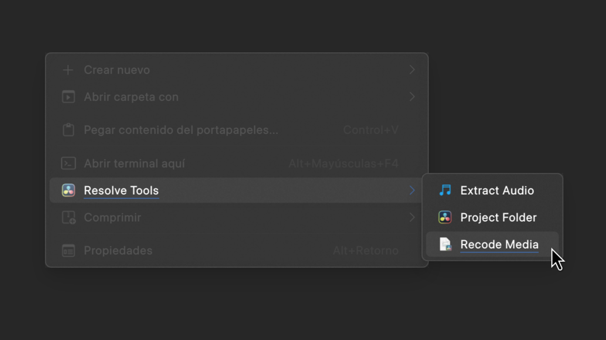

# Resolve Tools

<https://www.pling.com/p/2182811/>



Resolve Tools is a collection of practical tools and utilities designed to simplify and streamline a variety of common processes and tasks. The toolset covers a wide range of functionality, from file and directory manipulation to workflow automation.

With Resolve Tools, users can save time and effort by having at their disposal a set of efficient and reliable solutions that allow them to focus on their core tasks without worrying about technical details. Resolve Tools offers versatile, easy-to-use tools that can be tailored to a wide variety of needs.

Explore the Resolve Tools suite and discover how you can simplify and streamline your daily workflows.

## How to install

### Clone the repository

```sh
git clone https://github.com/gabrielcapilla/resolve-tools.git
```

### Run the installation script

```sh
cd resolve-tools/tools && chmod +x setup && ./setup
```

## About Resolve Tools

### Extract Audio

The Extract Audio utility extracts audio from video files to FLAC format. Currently, Extract Audio supports extracting audio from MP4, MKV and MOV video formats.

### Recode Media

The ‘Recode Media’ utility converts video files to a compatible format in a MOV container. Currently, ‘Recode Media’ supports the conversion of MP4, MKV and MOV formats.

### Project Folder

The ‘Project Folder’ utility creates a group of folders for a new project. The structure of the subfolders is as follows:

```sh
Poject Folder
 ┣ Audio
 ┃ ┣ Music
 ┃ ┣ Sound-effects
 ┃ ┗ Voice-over
 ┣ Footage
 ┃ ┣ A-Roll
 ┃ ┗ B-Roll
 ┗ Thumbnails and images
 ```

## Roadmap

### To Do

- [ ] Support for more video formats: I will extend ‘Recode Media’ support to include additional video formats, such as AVI, WMV and WEBM. This will give users greater flexibility and more options for converting their video files.
- [ ] Audio extraction enhancements: I will expand support for ‘Extract Audio’ to include the ability to extract audio in additional formats, such as OGG and WAV, in addition to the current FLAC format. This will allow users to choose the audio format that best suits their needs.
- [ ] Error handling: I will integrate kdialog to notify users in a clear and friendly way when errors occur during the execution of the tools. This will help users to more easily understand and resolve any problems that may arise.
- [ ] Multi-language support: I will implement the ability to generate the project folder structure in multiple languages. This will allow users from different regions and cultural backgrounds to use Resolve Tools in a more natural and tailored way.

### Completed ✓

- [x] Progress indicators: I will implement the use of the kdialog tool to provide users with visual progress indicators during the ‘Recode Media’ and ‘Extract Audio’ processes. This will provide users with a better experience and feedback on the status of tasks.
