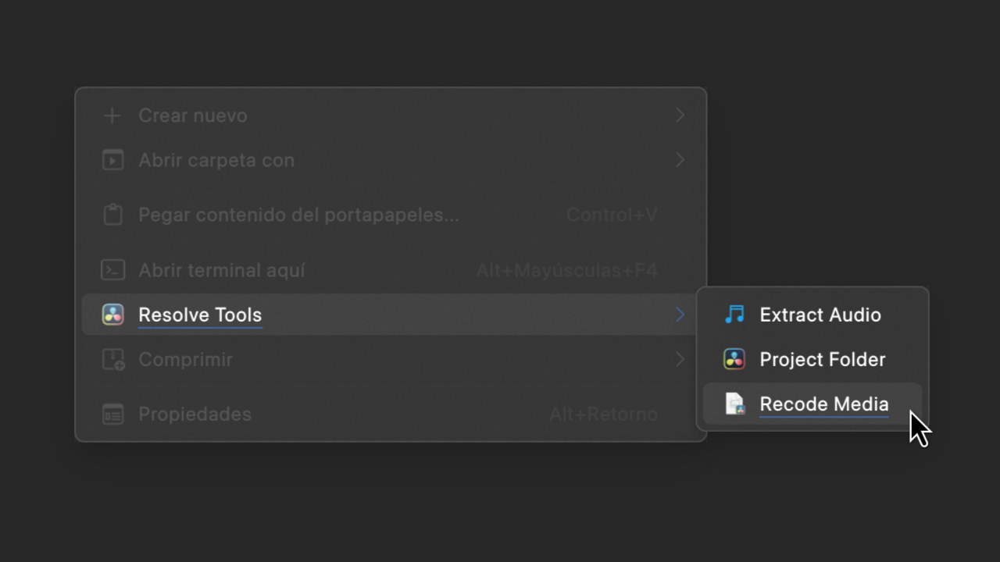

# Resolve Tools

A collection of utilities for video editing workflows in KDE Plasma. Integrates with Dolphin file manager to provide quick actions for project creation and media processing.



## Features

- **Create Project**: Generates a folder structure (Audio, Footage, Images, Exports) for new projects
- **Recode Video**: Converts videos to DaVinci Resolve-compatible format (H.264 in MKV container)
- **Extract Audio**: Saves audio tracks as FLAC files
- **KDE Integration**: Actions available in Dolphin's right-click menu
- **Progress Dialogs**: Visual feedback during operations using kdialog
- **Multi-language**: Supports English and Spanish (auto-detected)

## Requirements

- KDE Plasma desktop environment
- ffmpeg and ffprobe
- kdialog and qdbus

## Installation

```sh
git clone https://github.com/gabrielcapilla/resolve-tools.git
cd resolve-tools
sh ./tools/manage.sh install
```

## Usage

Right-click in Dolphin to access Resolve Tools actions.

### Create Project

1. Right-click an empty area in the target directory
2. Select **Resolve Tools → Create Resolve Project**
3. Enter the project name
4. The folder structure is created automatically

### Recode Video

1. Right-click a video file
2. Select **Resolve Tools → Recode Media Files**
3. A `media_files` folder is created with the converted video

### Extract Audio

1. Right-click a video or audio file
2. Select **Resolve Tools → Extract Audio from Video**
3. Audio is saved as FLAC in the `media_files` folder

## Management

The `tools/manage.sh` script handles installation tasks:

```sh
./tools/manage.sh install    # Install to ~/.local/share/kio/servicemenus
./tools/manage.sh uninstall  # Remove from system
./tools/manage.sh make       # Create tar.gz distribution
```

## Links

- **GitHub:** [gabrielcapilla/resolve-tools](https://github.com/gabrielcapilla/resolve-tools)
- **KDE Store:** [Dolphin Service Menu](https://store.kde.org/p/2182811)
